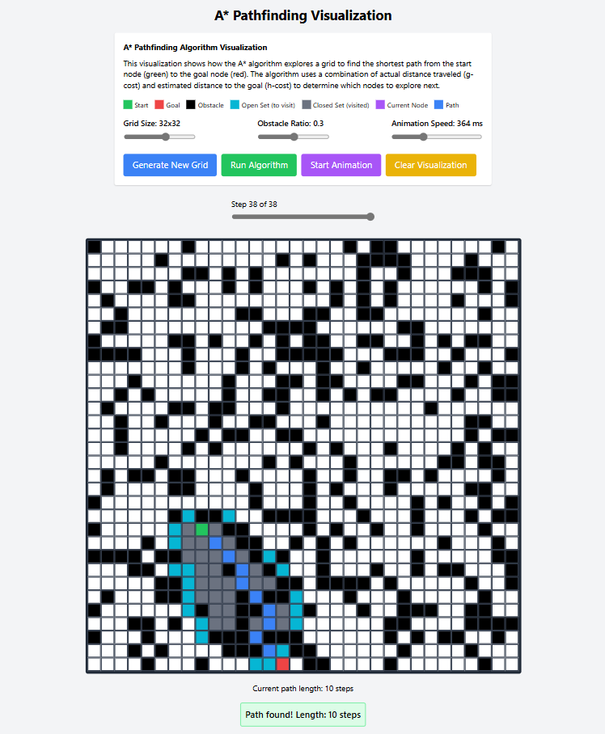

# 🌟 A* Pathfinding Visualization

This project presents a grid-based visual simulation of the A\* (A-Star) algorithm. The shortest path between the start point (green) and the goal point (red) is visualized step by step. Obstacle cells are randomly placed, and the algorithm navigates around them to find the path.




## 🚀 Features

- Step-by-step animated visualization of the A* algorithm
- Adjustable obstacle density, grid size, and animation speed
- Live color-coded display of the open set, closed set, current node, and final path

---

## ⚙️ Requirements

- [Node.js](https://nodejs.org) (comes with npm)
- A modern web browser (Chrome, Firefox, Edge, etc.)

---

## 🚀 How to Run the Project from Scratch

To run this project on your local machine, follow the steps below:

### 1. Clone the Repository or Extract the ZIP File

```bash
git clone https://github.com/silakscu27/A-star-visualizer.git
cd A-star-visualizer

